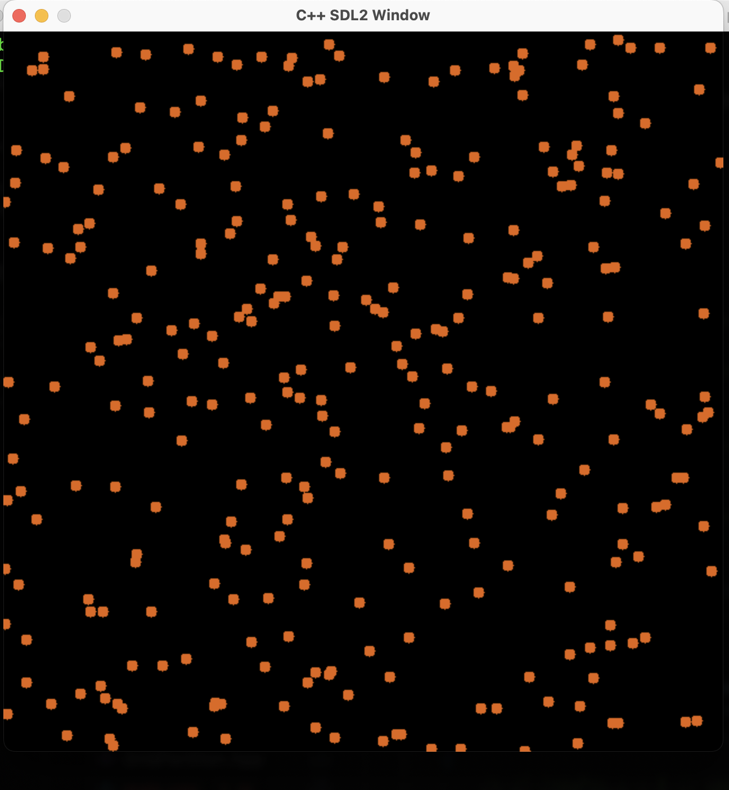

# Circle Simulation with SDL2

## Description

This C++ application is designed to demonstrate the simulation of circles in a 2D space using the SDL2 library. It not only renders these circles but also effectively handles their collision detection. At its core, the program aims to illustrate the performance benefits of optimized collision detection algorithms compared to naive methods.

The following video demonstrates this project in action: https://youtu.be/ZnzW5qGurSY?si=LqNF0f-8lHwgQc5Y



## Features

- Random circle generation : The application generates a random set of circles with varying positions and radii. These circles are displayed in a window generated using SDL2.
- Circle collision detection : Two methods are employed to detect if any circles collide:
  - Naive Collision Detection: In this approach, every circle is compared with every other circle to check for collisions. While straightforward, this is computationally expensive.
  - Grid Partitioning: To speed up the collision detection, the application optionally uses a grid-partitioning algorithm. This algorithm divides the 2D space into smaller cells, or 'grids', and only checks for collisions within these grids.
- Real-time Updates: The program is designed to handle real-time updates efficiently. Circles can move and respond to collisions, and the display updates in real-time.
- Optional timing output for performance measurement

## Requirements

- C++ Compiler
- SDL2 Library

## Compilation and Execution

First, make sure to install the SDL2 development library for your system.

To build the project, simply run the `build.py` script:

```bash
python build.py
This will compile the project into an executable.
```

Run the program as follows:

```bash
./output_program_name number_of_circles [print_timing] [naive]
```

### Command Line Arguments

1. `number_of_circles`: Required. Specifies the number of circles to generate.
2. `print_timing`: Optional. If set to 1, prints the time taken by each iteration.
3. `naive`: Optional. If present, the program will use naive collision detection.

## Functions and Classes

- `drawPoint()`: Draws a point on the SDL renderer.
- `drawCircle()`: Draws a circle using a given algorithm.
- `drawFilledCircle()`: Draws a filled circle on the SDL renderer.
- `main()`: Entry point of the program.

## Authors

- Abhijeet Chowdhury

## License

This project is licensed under the MIT License.
